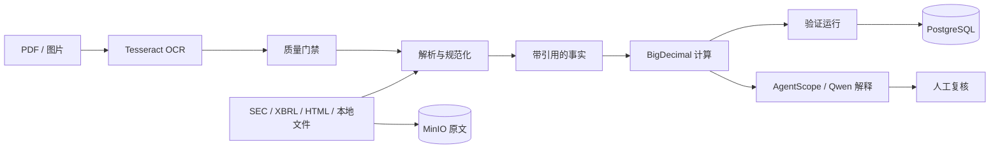

# Financial Disclosure

Financial Disclosure 是一个财务申报接收、事实核验和审计服务。当前主运行时为 Java 17 + Spring Boot，申报原文写入 MinIO，申报版本和验证运行写入 PostgreSQL，所有金额、差额和容差判断由 `BigDecimal` 完成。语言模型只允许解释已经计算并带引用的事实，不能替代财务计算。

仓库同时保留 Python 领域实现，用于 SEC/XBRL/HTML 适配、OCR、缓存与租约、恢复演练和独立 live smoke。Java 与 Python 测试分别执行，不能用其中一套的通过结果替代另一套真实集成验证。

## 项目简介与适用场景

上面的说明定义了服务的财务核验用途和模型使用边界。

## 功能清单

- 类型化申报和验证 API，请求参数使用 Bean Validation 校验。
- PostgreSQL 保存申报版本、内容校验和验证运行，Flyway 管理表结构。
- MinIO 保存原始申报内容，相同 SHA-256 内容幂等返回既有版本。
- `BigDecimal` 计算实际值、期望值、差额和容差结论。
- SEC EDGAR、XBRL、HTML 和 Recorded 来源适配器彼此独立。
- Tesseract + Poppler 本地 OCR，包含识别质量门禁和失败状态。
- AgentScope Java 可选接入 Qwen，只解释确定性计算结果。
- Python 持久化层覆盖事实、缓存、租约、验证运行和审计语义。
- 恢复脚本支持生命周期回滚、租约接管和故障演练。

## 系统架构与核心流程



模型输入只包含服务端已经计算的事实、单位和引用。原始申报文本不会被模型直接当作数值结论，模型不可修改验证结果。

## 技术栈与运行依赖

| 分类 | 组件 |
| --- | --- |
| Java 服务 | Java 17、Spring Boot 3.3、Spring MVC、Bean Validation |
| 数据与存储 | PostgreSQL 16、Spring Data JPA、Flyway、Redis、MinIO |
| Agent | AgentScope Java 2.x、DashScope/Qwen |
| 文档处理 | SEC EDGAR、XBRL、HTML、Tesseract、Poppler |
| Python 组件 | Python 3.12、FastAPI、Pydantic、Decimal |
| 质量工具 | JUnit、Pytest、Ruff、Mypy、Docker Compose |

## 目录结构说明

```text
src/main/java/                         Spring Boot 主服务
src/main/resources/db/migration/       Flyway 迁移
src/test/java/                         Java API 与计算测试
app/financial_disclosure/              Python 领域实现和适配器
app/financial_disclosure/ocr/          OCR 与质量门禁
app/financial_disclosure/persistence/  缓存、租约和审计持久化
scripts/financial_disclosure/           live smoke 与恢复演练
migrations/                             Python 持久化迁移
docker/Dockerfile                       Java 服务镜像
compose.yaml                            PostgreSQL、Redis、MinIO 和应用
tests/                                  Python 单元、契约和集成测试
```

当前仓库提供 API 和 Swagger UI，尚未实现独立业务前端。Swagger 只用于接口调试，不能等同于申报检索、文档阅读和运维页面已经完成。

## 环境要求

- Docker Desktop，用于运行 PostgreSQL、Redis、MinIO 和 Java 服务。
- Python 3.12，用于 Python 测试、OCR 和 live smoke。
- 本机直接构建 Java 时需要 JDK 17 和 Maven 3.9；使用 Docker 时不需要本机 Maven。
- OCR 需要 Tesseract 5；PDF OCR 还需要 Poppler 的 `pdftoppm`。
- AgentScope/Qwen 验证需要本地配置 `QWEN_API_KEY`。

## Docker 或中间件启动方式

启动中间件：

```bash
docker compose -f compose.yaml up -d --wait postgres redis minio
```

构建并启动完整 Java 服务：

```bash
docker compose -f compose.yaml --profile full up -d --build --wait
```

服务地址：

| 服务 | 地址 |
| --- | --- |
| API | http://127.0.0.1:8001 |
| Actuator | http://127.0.0.1:8001/actuator/health |
| PostgreSQL | `127.0.0.1:5433` |
| Redis | `127.0.0.1:6380` |
| MinIO API | http://127.0.0.1:9010 |
| MinIO Console | http://127.0.0.1:9011 |

停止环境：

```bash
docker compose -f compose.yaml --profile full down
```

Compose 中的账号密码仅用于本地开发。部署到共享环境前必须改为外部 Secret，不能提交真实值。

## 本地快速启动

先启动 PostgreSQL、Redis 和 MinIO，再执行：

```bash
mvn spring-boot:run
```

没有本机 Maven 时可直接运行测试容器：

```bash
docker run --rm -v "${PWD}:/workspace" -w /workspace maven:3.9.9-eclipse-temurin-17 mvn -B test
```

Python 参考服务的开发启动方式：

```bash
python -m venv .venv
python -m pip install -e .
python -m uvicorn financial_disclosure.api:app --app-dir app --host 127.0.0.1 --port 8011
```

Java 与 Python 服务不要占用同一端口。

## 配置项和环境变量

| 变量 | 默认值 | 用途 |
| --- | --- | --- |
| `POSTGRES_URL` | `jdbc:postgresql://127.0.0.1:5433/financial_disclosure` | Java JDBC 地址 |
| `POSTGRES_USER` | `financial` | PostgreSQL 用户 |
| `POSTGRES_PASSWORD` | 本地开发值 | PostgreSQL 密码 |
| `REDIS_HOST` / `REDIS_PORT` | `127.0.0.1` / `6380` | Redis 地址 |
| `MINIO_ENDPOINT` | `http://127.0.0.1:9010` | MinIO API |
| `MINIO_BUCKET` | `financial-disclosures` | 原始申报 Bucket |
| `FINANCIAL_SEC_USER_AGENT` | 空 | SEC 要求的联系人 User-Agent |
| `FINANCIAL_TESSERACT_BINARY` | `tesseract` | Tesseract 路径 |
| `FINANCIAL_OCR_LANGUAGE` | `eng` | OCR 语言 |
| `FINANCIAL_AGENT_ENABLED` | `false` | 是否启用 AgentScope |
| `QWEN_API_KEY` | 空 | Qwen 密钥，不得提交 |
| `QWEN_CHAT_MODEL` | `qwen-plus` | 文本模型 |
| `FINANCIAL_DISCLOSURE_BASE_URL` | 空 | live smoke 的服务地址 |

## 主要 API

| 方法 | 路径 | 说明 |
| --- | --- | --- |
| `GET` | `/health` | 基础健康检查 |
| `POST` | `/api/filings` | 保存申报内容和版本 |
| `POST` | `/api/verification-runs` | 执行确定性数值核验 |

## 请求示例与返回结果

### 保存申报

```bash
curl -X POST http://127.0.0.1:8001/api/filings \
  -H "Content-Type: application/json" \
  -d '{
    "filingId": "filing-2026-001",
    "form": "10-K",
    "format": "xbrl",
    "content": "<xbrl>...</xbrl>",
    "version": "2026-01"
  }'
```

格式只接受 `xbrl`、`html`、`pdf` 或 `image`。服务计算内容 SHA-256，相同内容再次提交会返回 `duplicate=true`。

### 创建验证运行

```bash
curl -X POST http://127.0.0.1:8001/api/verification-runs \
  -H "Content-Type: application/json" \
  -d '{
    "filingId": "filing-2026-001",
    "factName": "revenue",
    "actualValue": 1200.50,
    "expectedValue": 1200.50,
    "tolerance": 0.01,
    "unit": "USD",
    "citation": "filing-2026-001:2026-01#revenue"
  }'
```

`actualValue`、`expectedValue` 和 `tolerance` 必填，`tolerance` 不得为负。缺失或非法值返回 `400`，不会写入验证记录。

## 离线测试

Java 测试：

```bash
mvn -B test
```

或使用 Maven 容器：

```bash
docker run --rm -v "${PWD}:/workspace" -w /workspace maven:3.9.9-eclipse-temurin-17 mvn -B test
```

Python 测试和静态检查：

```bash
python -m pytest -q
ruff check app tests scripts
mypy app
python -m compileall -q app tests scripts
```

Python 测试中的 Recorded 来源和确定性模型适配器只用于离线行为验证，不代表 SEC、数据库、对象存储或真实模型已连通。

## 真实服务验证

OCR smoke 会自行生成测试图片，不需要准备私有文件：

```bash
python scripts/financial_disclosure/live_smoke.py --component ocr
```

服务和模型 smoke：

```bash
export FINANCIAL_DISCLOSURE_BASE_URL=http://127.0.0.1:8001
python scripts/financial_disclosure/live_smoke.py --component health
python scripts/financial_disclosure/live_smoke.py --component model
```

PowerShell 使用 `$env:变量名 = "值"` 设置相同环境变量。模型 smoke 还需要 `QWEN_API_KEY` 和 `QWEN_CHAT_MODEL`。

退出码统一为：`0` 验证通过，`1` 已连接但断言失败，`2` 缺少服务、依赖或授权。当前脚本尚未覆盖 PostgreSQL、Redis、MinIO 和 SEC 的独立读写 smoke，因此这些集成不能仅凭容器健康状态标记通过。

## OCR

本地 OCR 不需要注册云服务：

```bash
tesseract --version
tesseract --list-langs
pdftoppm -v
```

至少需要 `eng` 语言包；识别中文需要 `chi_sim`。如果 Tesseract 不在 `PATH`，设置 `FINANCIAL_TESSERACT_BINARY` 为绝对路径。低质量 OCR 必须进入复核或失败状态，不得直接进入可信事实集。

## 常见问题与故障排查

### Java 服务启动时数据库连接失败

确认 PostgreSQL 已健康，并检查 JDBC 地址在宿主机和容器内是否分别使用 `127.0.0.1:5433` 与 `postgres:5432`。

### MinIO 写入失败

确认 `MINIO_ENDPOINT` 指向 API 端口而不是 Console 端口。服务会在首次写入时创建 Bucket，但账号必须具有相应权限。

### AgentScope 启动失败

`FINANCIAL_AGENT_ENABLED=true` 时必须提供 `QWEN_API_KEY`。缺少密钥会失败关闭，不会切换为离线模型。

## 安全边界和生产注意事项

- 不提交 `.env`、API key、Cookie、Token、私有申报原文和运行日志。
- 财务数字只由 `BigDecimal`/`Decimal` 计算，模型不得生成或修正数值。
- SEC 请求必须配置可联系的 User-Agent，并遵守来源限制。
- OCR、模型、外部来源、数据库和对象存储需要分别验收。
- 当前缺少完整业务前端、真实中间件独立 smoke、三轮评测、压测和故障恢复证据，不能标记为 deployment-ready。

## License

MIT，详见 [LICENSE](LICENSE)。
